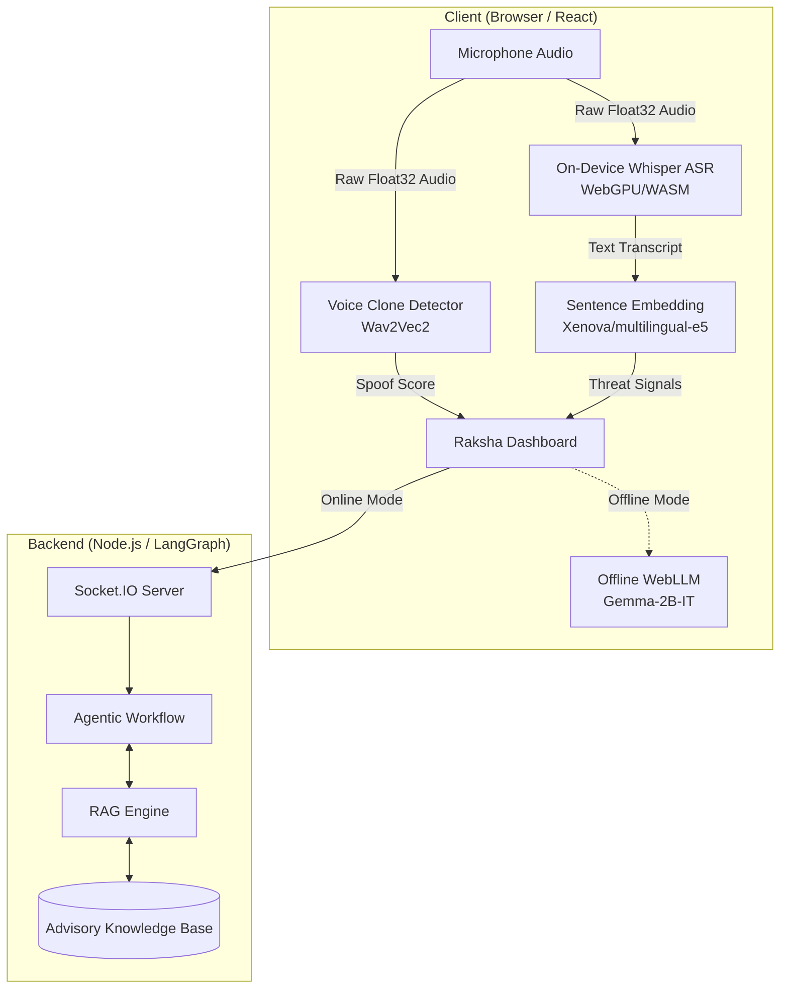

# Raksha: System Architecture

Raksha is designed with a **Two-Tier Privacy-First Architecture**, ensuring that high-speed, sensitive operations (like transcription and voice analysis) happen entirely on the user's device, while complex reasoning is handled either by a secure cloud node or an offline local Large Language Model (LLM).

---

## 1. High-Level Architecture

---

## 2. Tier-1: On-Device Edge Processing (Zero-Cloud)

The first tier operates entirely within the browser using **WebAssembly (WASM)** and **WebGPU**. This ensures that raw audio from the user's microphone never leaves the device.

### Core Modules:
1. **Whisper ASR (`whisper.worker.js`):** 
   - Uses `@huggingface/transformers` to run the `Xenova/whisper-tiny` model.
   - Captures microphone audio, resamples it to 16kHz, and translates Hindi/English speech into text locally.
2. **Voice-Clone Detector (`voiceClone.worker.js`):**
   - Analyzes raw audio streams for synthetic speech artifacts and unnatural cadences (using heuristics and the `wav2vec2-base` model) to immediately flag AI-cloned voices.
3. **Sentence Classifier (`classifier.worker.js`):**
   - Uses `Xenova/multilingual-e5-small` to convert transcript text into vector embeddings.
   - Computes cosine similarity against known scam phrase embeddings (e.g., "Urgency", "Financial Coercion", "Authority Impersonation") to generate real-time threat signals.

---

## 3. Tier-2: Agentic Orchestration & Reasoning

When Tier-1 detects significant threat signals, the system moves to Tier-2. Raksha supports two modes for Tier-2 reasoning:

### A. Online Mode (LangGraph & Cloud Backend)
- **Data Privacy:** Only extracted textual signals (e.g., `["urgency", "financial_threat"]`) and limited text snippets are sent to the backend via secure WebSockets.
- **Workflow:** A LangGraph pipeline orchestrates the reasoning process:
  1. **Retrieval:** Uses RAG to query the official cybercrime advisory database (`data/sample_advisories.json`).
  2. **Reasoning:** An LLM evaluates the live signals against the official playbooks.
  3. **Scoring:** Generates a deterministic Risk Score and an action (`safe`, `warn`, or `block`).

### B. Offline Mode (WebLLM)
- **Extreme Privacy/No Network:** If the user toggles "Offline Mode" or loses internet connectivity, the system completely bypasses the backend.
- **On-Device Reasoning:** Uses `@mlc-ai/web-llm` to load **Gemma-2B-IT** into browser memory via WebGPU. The LLM performs the exact same RAG and reasoning pipeline locally.

---

## 4. State Management & Lifecycle

- **XState (`callMachine.js`):** Governs the deterministic lifecycle of a phone call. It handles transitions between states: `idle` → `active` → `warn` → `block`. It guarantees that a call cannot drop back to `active` once a critical threshold (100/100 risk) is reached.
- **Zustand (`useRakshaStore.js`):** Acts as the centralized reactive data store for the React frontend, managing the continuous stream of signals, transcripts, UI alerts, and backend WebSocket updates.

---

## 5. Security & Privacy Guarantees

1. **No Audio Transmission:** No raw audio or voice data is ever transmitted over the network.
2. **Signal-Only Cloud Payload:** Only abstract threat classifications are evaluated in the cloud.
3. **Full Edge Capability:** The entire security stack can run offline, ensuring continuous protection regardless of network availability.
